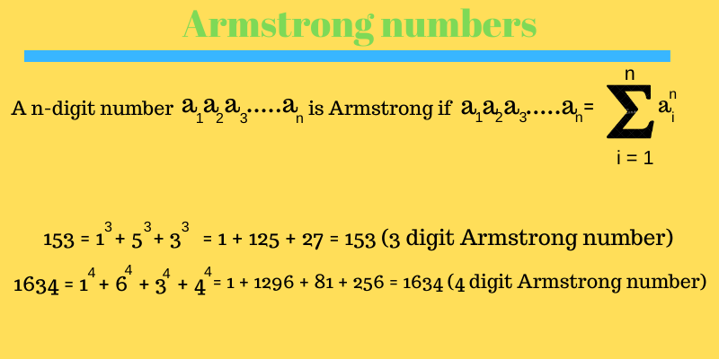

<div align="center">
<!-- Title: -->
  <a>
    <p align="center"></p>
  </a>
  <h1><a>Algorithms</a> - Python</h1>

  <h3>This algorithms implemented in C# - for education</h3>
</div>

The armestrong number is a number that is equal to te sum of its own digits each raised to the power of the number of digits.

#### Example:

```
For 371
3^3 = 27
7^3 = 343
1^3 = 1

27 + 343+ 1 = 371
```

#### 371 is an Armstrong number

## Problem? Write a function to find whether a number is an Armstrong or not?

```c#
      int triple(int x) {
        return x * x * x;
      }

      bool is_armestrong (int number) {
        int digit, temp, sum = 0; 
        temp = number;  
        while (number > 0)  
        {  
            digit = number % 10;  
            sum =sum+triple(digit);  
            number= number/ 10;  
        }  
        if (temp == sum)  
            return true;
        else  
            return false;
      }

      Console.Write(is_armestrong(371));
```
