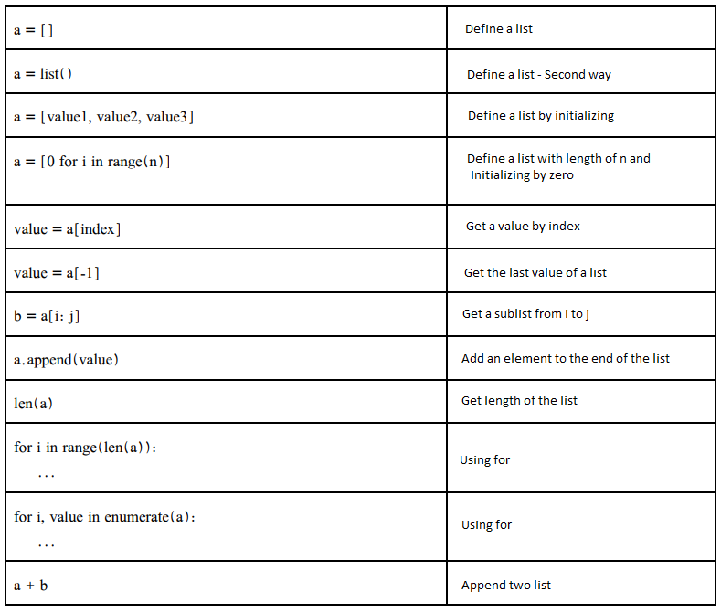
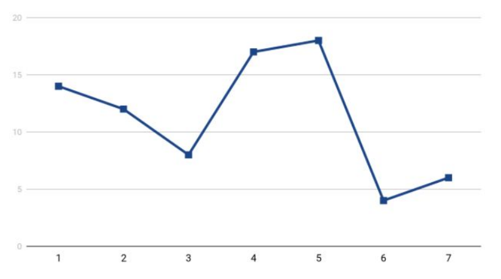
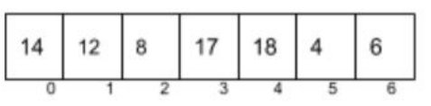

<div align="center">
<!-- Title: -->
  <!-- <a>
    
  </a> -->
  <h1><a>Lists</a> - Java Script</h1>

  <h3>This algorithms implemented in Python - for education</h3>
</div>

List is a data structure which is hold a series of data. Each element of a list is accessible by its index.

### Difference between List and Array
The length of the list can be changed. We can add or subtract elements from the end of the list. List is very useful for solving problems. For example Investigating the increase or decrease of a company's stock is a good subject for the lists.

# How lists work in Phyton
<p align="center"></p>

# Buy and sell a stock with the highest return investment

### Question
A list of stocks of a company has been given. You can buy & sell only one stock. Create a solution to returns the highest investment.


In the below picture we can see the data of stock investments during a week.
<p align="center"></p>

By viewing the data we can realise highest investment would be buy in the third day and sell in the fifth.
    **investment = 18 - 8 = 10**

Now first of all we need to create a data structure, so we need to create a list from the data like below:
<p align="center"></p>

# Brute force approach

```
1. def higherInvestment(list)
2. nums_len = len(list)
3. for i in range(nums_len):
4. for j in range(i+1, nums_len):
5. set investment to list[i] - list[j]
6. if investment < list[i] - list[j]
7. swap
8. return investment
```

After analyzing algorithm we found out this solution works worst for the problems that includes large input size. Complexity will be : O(n²)

This algorithm is a correct way to solve this problem but regarding performance we need to find a faster way. This way wouldn't work properly when data size starts to grow.

## Demo Link
https://replit.com/@golnarmordadi/Highest-Investment-Solution?v=1


# Solution

For making better solution we need to find why this way not wroks well, then correct that. Getting improvement would be achieved by removing repetitive activities.From the first of the list we start to navigate, for example we shall pick a day for sell then we should find min stock between the previous days. Therefore if the lenght of the list would be n the big O would be O(n). 
This means we get improvement.

```
1. import sys
2. def maxprofit(prices)
3.  pmin = sys.maxint
4.  profit = 0

5.  for i in range(len(prices))
6.  pmin = min(prices[i], pmin)
7.  profit = max(profit, prices[i]-pmin)

8. return profit
```
