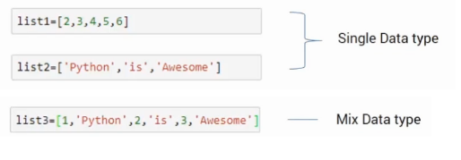

<div align="center">
<!-- Title: -->
  <a>
  <p align="center"></p>
  </a>
  <h1><a>Lists</a> - Python</h1>

  <h3>This algorithms implemented in Python - for education</h3>
</div>

# Overview
List is a data structure that stores elements in an ordered and sequential manner. A list can store repetitive elements which means a single element can occur more than once in a list.

## What is a List?
List is an ordered data structure that is used to store different or same elements in a sequential manner.

## Difference between Array and List
The list is similar to array in data structure but in the array, we can store only the elements which are of same data-type whereas in the list in the data structure, with some of the programming languages like python and javascript we can store elements with different data types also.

```javascript
let list1 = ['scaler',234,78,true]
```

There is no need to define static size to the list i.e we can add more elements to the list dynamically and as the new elements get added to the list, the size of the list increases dynamically.


## Operation on List Data Structure

  * Add or insert operation
  * Replace or reassign operation
  * Delete or remove operations
  * Find or lookup or search operations 

## CRUD operation on List in Javascript :

```javascript

const balanced_diet = [];  
var idx = 0; 

// function to add or insert balanced diet constituents to the balanced_diet list

function add_balanced_diet_constituents(constituent){  
        balanced_diet[idx] = constituent;  
        idx++;  
}

// function to delete/remove balanced diet constituents from balanced_diet list.

function delete_balanced_diet_constituents(constituent){  
        var constituent_index = balanced_diet.indexOf(constituent);  
        if (constituent_index > -1) {  
            balanced_diet.splice(constituent_index, 1);  
        }  
}

 // function to update balanced diet constituents in balanced_diet list 

function update_balanced_diet_constituents(old_constituent, new_constituent){  
        var old_constituent_index = car_names.indexOf(old_constituent);  
        balanced_diet[old_constituent_index]= new_constituent;   
}

 // function to print all balanced diet constituents from the balanced_diet list

function print_all_constituents(){  
        console.log(balanced_diet);  
}

```

# Conclusion

  * list in the data structure is an ordered data structure that stores elements sequentially and can be accessed by the index of the elements.
  * list in the data structure can store different or same data types elements depending on the type of programming language that is being used.
  * we can perform add/insert, delete/remove, update and search/lookup operations on list in data structure.