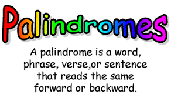

<div align="center">
<!-- Title: -->
  <a>
    <p align="center"></p>
  </a>
  <h1><a>Palindrome</a> - C#</h1>

  <h3>This algorithms implemented in C# - for education</h3>
</div>

## What is a palindrome, and what does it mean?
A palindrome is a word, sentence, verse, or even number that reads the same backward or forward. So it is like a word, phrase, or number that “runs back” on itself. This bit of wordplay is not the same thing as when you rearrange the letters of a word or phrase to spell another one.

## List of palindromes and palindrome phrases
* kayak
* deified
* rotator
* repaper
* deed
* He lived as a devil, eh?
* Ned, I am a maiden. 
* Now, sir, a war is won!
* Evade me, Dave!

## Problem: Checking a String
Check the given string is palindrome or not. If the string is palindrome return "YES" or if not return "NO".

```c#
  public static void Is Palindrome(String text)
    {
      // Example text = "abba";

      int leftPointer = 0;
      int rightPointer = text.Length - 1;
      
      while(leftPointer < rightPointer) {
        if(text[leftPointer] != text[rightPointer]) {
          Console.Write("NO");
        } else {
          Console.Write("YES");
        }

        leftPointer++;
        rightPointer--;
      }
  
    }
```
