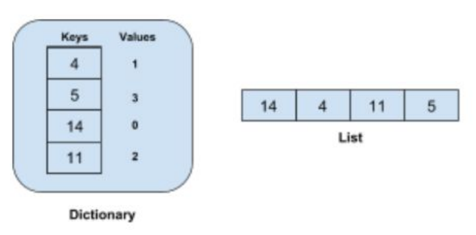

<div align="center">
  <h1><a>Find Target between a Sequence of Numbers</a> - Pseudo Code</h1>

  <h3>Create a code which returns index of elements that sum of them is equal with 10</h3>
</div>


  <p align="center"></p>


## Brute force approach

target = 10

```
1. def twosum(nums, target)
2. nums_len = len(nyms)
3. for i in range(nums_len):
4. for j in range(i+1, nums_len):
5. if nums[i] + nums[j]==target:
6. return [i , j]
```

**Demo Link**

https://jsbin.com/gaxokifake/edit?js,console

While a brute-force search is simple to implement and will always find a solution if it exists, implementation costs are proportional to the number of candidate solutions – which in many practical problems tends to grow very quickly as the size of the problem increases. Therefore, brute-force search is typically used when:
* The problem size is limited
* When there are problem-specific heuristics that can be used to reduce the set of candidate solutions to a manageable size. 
* The method is also used when the simplicity of implementation is more important than speed.
* Brute-force search is also useful as a baseline method when benchmarking other algorithms or metaheuristics

After analyzing algorithm we found out this solution works worst for the problems that includes large input size. Complexity will be : O(n²)


## Solution
There will be a bette way to get improvement for the problem with large input size. It is enough to remove the repeated steps to reach a better algorithm OR may be need to think about the other data structure, how I can get help of other data structures to make a faster algorithm. Also need to ask some question, like I need to find the value of the element whose complement is in the list. 

```
x      complement      target-x
```

With above aproach I just need to find complements but not with searching for them instead using different data structure named : Dictionary.

```
Dictionary OR Hashtable  is the data structure can tell us is a number into the list or not without searching for all elements.
```

This way would have complexity of O(n) or linier compexity and will work good.


  <p align="center"></p>


```
1.  def twoSum(nums, target):
2.  h = {}
3.  for i in range(len(nums)):
4.    if target-nums[i] in h:
5.      return [h[target-nums[i]], i]
6.    else:
7.      h[num[i]] = i
```

**Demo Link**
https://replit.com/@golnarmordadi/Search-Problem?v=1
